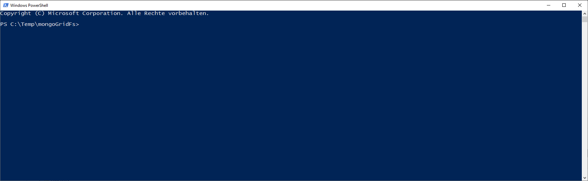

# PowerShell Cmdlets and Providers

[](https://dev.azure.com/mbc-engineering/cmdlet/_build/latest?definitionId=1&branchName=master)


Project for extensions like cmdlet or providers for Windows-Powershell.

## Requirements
- .Net Framework >= 4.7.1
- PowerShell >= 5.1

## MongoDbGridFs Provider

This project is an extension for the Windows-Powershell and gives the easy possibility to work with a [MongoDB-GridFs].



### How to use:

Just run the setup to install and register the provider on your system.
But if you want to try it first, without installation or as portable version, you can import the `MongoDbGridFsProvider.psd1` with the ```Import-Module``` by your own.

Check the `MongoDbGridFs` Provider is correctly installed with 
```powershell
> Get-PSProvider
Name                 Capabilities                                                                                                       Drives
----                 ------------                                                                                                       ------
Registry             ShouldProcess, Transactions                                                                                        {HKLM, HKCU}
Alias                ShouldProcess                                                                                                      {Alias}
Environment          ShouldProcess                                                                                                      {Env}
FileSystem           Filter, ShouldProcess, Credentials                                                                                 {C, D, E, H...}
Function             ShouldProcess                                                                                                      {Function}
Variable             ShouldProcess                                                                                                      {Variable}
MongoDbGridFs        Filter, ExpandWildcards, ShouldProcess, Credentials                                                                {NspMongo}
Certificate          ShouldProcess                                                                                                      {Cert}
WSMan                Credentials                                                                                                        {WSMan}
```

#### Register PSDrive:

In order to use the provider, you must first register it.

```powershell
> New-PSDrive -PSProvider MongoDbGridFs -Name Mongo -Root 'localhost' -Port '27017' -Database 'MyDb' -Collection 'files' -Verify	
```

Now the provider can simply be addressed by its name.

> The parameters `-Port` and `-Collection` don't have to be set (default Port='27017' and Collection='fs').

> For collection name the sufix `.files` and `.chunkes` must not be set

#### Remove PSDrive:

For listing all existing drive use

```powershell
> Get-PSDrive -PSProvider MongoDbGridFs
Name           Used (GB)     Free (GB) Provider      Root
----           ---------     --------- --------      ----
Mongo                                  MongoDbGridFs localhost
```

and then removing it
```powershell
> Remove-PSDrive Mongo
```

#### Get-ChildItem

Returns a list of all existing elements in the registred collection. This command gives a quick overview of existings elements and some meta-inforamtions.

Example:
```powershell
> Get-ChildItem Mongo:

FileName     Id                       UploadDateTime      length
--------     --                       --------------      ------
testFile     5cd92feb5ba2196a6c5f0da2 13.05.2019 08:50:51      1
```

#### Get-Item

Get a specific item from the collection, given by die objectId.

Example:
```powershell
> Get-Item Mongo:\5cd92feb5ba2196a6c5f0da2
```

In this way it is easy to store the binary content to a local drive

Example:
```powershell
> Get-Item Mongo:\5cd92feb5ba2196a6c5f0da2 -Target c:\temp\content.txt
```

#### Set-Item

Upload an existing file to the collection.

Example for upload foo.txt to the collection:
```powershell
> Set-Item Mongo:\foo.txt
```

#### Remove-Item

Deletes an existing element completely from the collection.

Example:
```powershell
> Remove-Item Mongo:\123769231768231876
```

#### Rename-Item

Overwrites the file-name property in the collection of the given element.

Example:
```powershell
> Rename-Item Mongo:\93097432780089734 -NewName foo2.txt
```

#### Get-Content

Get the content of an existing element from the collection.

Example:
```powershell
> Get-Content Mongo:\93097432780089734
```

#### Set-Content

Create a new element in the collection with content of the `Value` parameter.

Example:
```powershell
> Set-Content Mongo: -Name foo3.txt -Value "Test content"
```

# Legal and Licensing

MongoDbGridFsProvider is under the [Apache License 2.0].

[Apache License 2.0]: http://www.apache.org/licenses/LICENSE-2.0
[MongoDB-GridFs]:https://docs.mongodb.com/manual/core/gridfs/
